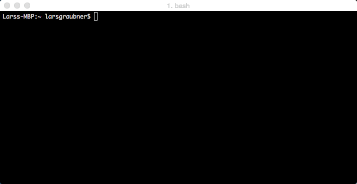

# Node Sitemap Generator

[](https://travis-ci.org/lgraubner/node-sitemap-generator) [](https://david-dm.org/lgraubner/node-sitemap-generator) [](https://www.npmjs.com/package/sitemap-generator)

> Creates an XML-Sitemap by crawling a given site.



## Installation

```BASH
$ npm install -g sitemap-generator
```

## Usage
```BASH
$ sitemap-generator [options] <url>
```

The crawler will fetch all sites matching folder URLs and certain file extensions. You can include files with `-i ext` or ignore files with `-e ext`. Most of the common file types are already black listed. File types parsed by Google are not black listed.

**Tip**: Omit the URL protocol, the crawler will detect the right one.

### Options
```BASH
$ sitemap-generator --help

  Usage: sitemap-generator [options] <url>

  Options:

    -h, --help                output usage information
    -V, --version             output the version number
    -q, --query               consider query string
    -i, --include [ext,ext2]  include fetched links by file extension, comma seperated
    -e, --exclude [ext,ext2]  exclude fetched links by file extension, comma seperated
    -o, --output [path]       specify output path
```

**Important**: Executing the sitemap-generator with sites using HTML `base`-tag along with links *without* leading slashes will probably not work.
